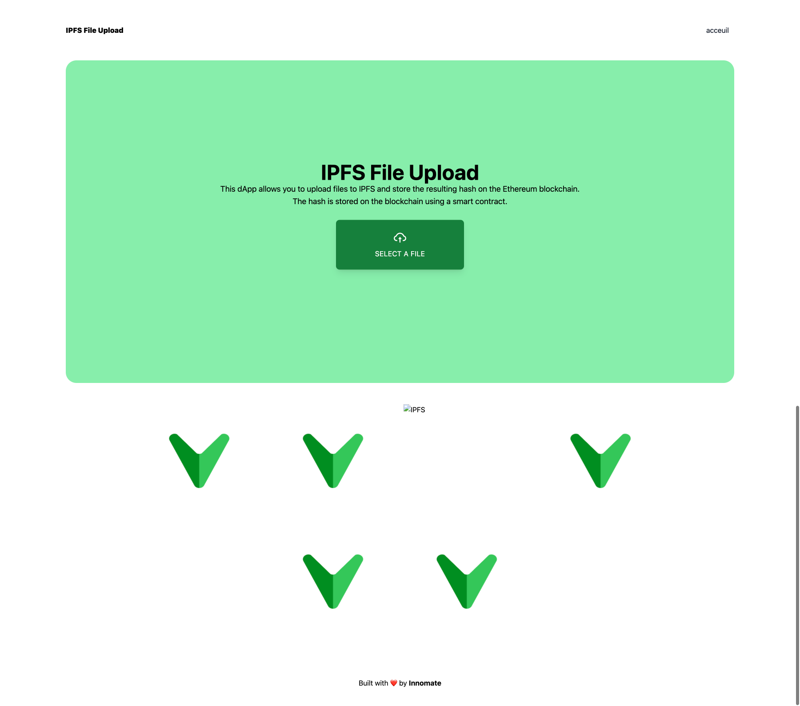

# React Dapp : IPFS File Upload


## Description

Projet est une application web qui permet de stocker des fichiers sur IPFS et de les enregistrer sur la blockchain Ethereum. L'application utilise React pour le front-end, Truffle pour le développement du smart contract et IPFS pour le stockage des fichiers.

## Features

- Ajouter un fichier
- Afficher la liste des fichiers par rapport à leur hash

## Technologies

- React
- Truffle
- IPFS


## Installation de IPFS

1. Télécharger IPFS sur le site officiel : https://docs.ipfs.io/install/command-line-quick-start/
2. Initialiser IPFS
```
ipfs init
```

3. Configurer IPFS
```
ipfs config --json API.HTTPHeaders.Access-Control-Allow-Origin '["http://localhost:3000"]'
ipfs config --json API.HTTPHeaders.Access-Control-Allow-Methods '["PUT", "GET", "POST"]'
```
4. Démarrer le daemon IPFS
```
ipfs daemon
```

## Installation de Truffle

1. Installer Truffle
```
npm install -g truffle
```

## Installation de l'application

1. Clone the repository
2. Go to truffle directory and install the dependencies
```
cd truffle
npm install
```
3. Deploid the smart contract
```
truffle migrate --reset
```
4. Install the dependencies for the client
```
cd ../client
npm install
```
5. Start the development server
```
npm start
```

## L'application




## L'equipe InnoMate

- CHAPART Damien
- SAINT MARS Benjamin
- TAGATAMANOGI Lelika
- MARCHESIN Lilou

### Repartition des taches

- CHAPART Damien : Front-end
- SAINT MARS Benjamin : Smart contract
- TAGATAMANOGI Lelika : IPFS
- MARCHESIN Lilou : Smart contract

## Développement de Fonctionnalités Avancées :

Enrichissez votre application en ajoutant des fonctionnalités avancées telles que la gestion des versions de fichiers, la cryptographie pour assurer la confidentialité des données, des fonctionnalités de partage sécurisé avec des contrôles d'accès basés sur la blockchain, etc. Ces fonctionnalités pourraient rendre votre application plus attractive pour les utilisateurs professionnels et les entreprises.
Exploration de Modèles Économiques Décentralisés :
Explorez la mise en place de modèles économiques décentralisés pour votre application, comme l'utilisation de tokens ou de jetons NFT (Non-Fungible Tokens) pour récompenser les utilisateurs qui contribuent au réseau IPFS ou pour offrir des services premium. Cela pourrait favoriser l'engagement des utilisateurs et la croissance de votre écosystème.

